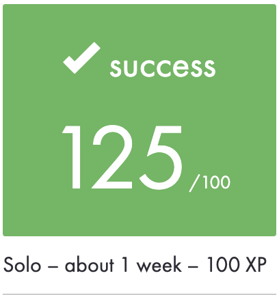
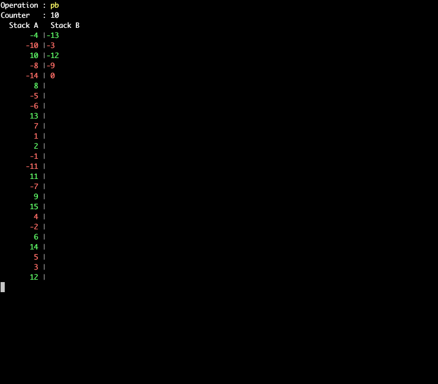

# School 21/42

## Push-swap

### Options

Flags | Description
------|------------
  -v  | Debugging mode /and color mode
  -f  | Reading instructions from a file

### Running

ARG=``ruby -e "puts (1..50).to_a.shuffle.join(' ')"``; ./push_swap $ARG | ./checker -v $ARG
